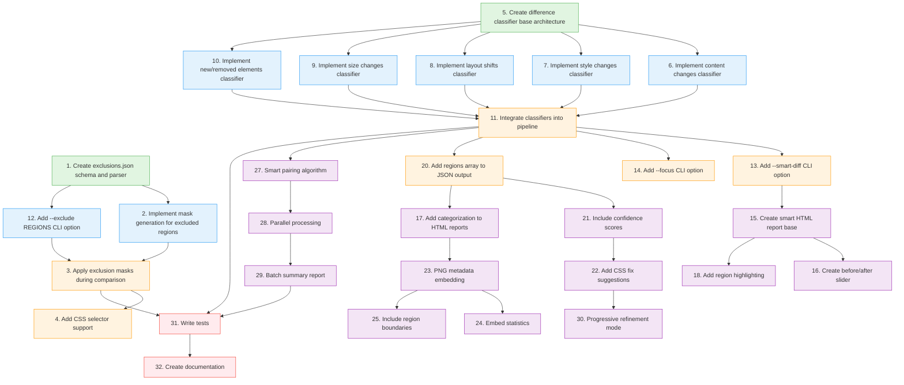

# Smart Features Implementation DAG

## Dependency Graph

## Implementation Order (Topological Sort)

### Phase 1: Foundation (Parallel) ✅ COMPLETED

- [x] Task 1: Create exclusions.json schema and parser
- [x] Task 5: Create difference classifier base architecture

### Phase 2: Core Components (Parallel) ✅ COMPLETED

After Phase 1:

- [x] Task 2: Implement mask generation for excluded regions
- [x] Task 12: Add --exclude REGIONS CLI option
- [x] Task 6: Implement content changes classifier
- [x] Task 7: Implement style changes classifier
- [x] Task 8: Implement layout shifts classifier
- [x] Task 9: Implement size changes classifier
- [x] Task 10: Implement new/removed elements classifier

### Phase 3: Integration ✅ COMPLETED

After Phase 2:

- [x] Task 3: Apply exclusion masks during comparison (depends on 2, 12)
- [x] Task 11: Integrate classifiers into pipeline (depends on 6-10)

### Phase 4: CLI & Basic Reporting ✅ COMPLETED

After Phase 3:

- [x] Task 4: Add CSS selector support (depends on 3)
- [x] Task 13: Add --smart-diff CLI option (depends on 11)
- [x] Task 14: Add --focus CLI option (depends on 11)
- [x] Task 20: Add regions array to JSON output (depends on 11)

### Phase 5: Enhanced Reporting ✅ COMPLETED

After Phase 4:

- [x] Task 21: Include confidence scores (depends on 20)
- [x] Task 17: Add categorization to HTML reports (depends on 20)
- [x] Task 15: Create smart HTML report base (depends on 13)
- [x] Task 27: Smart pairing algorithm (depends on 11)

### Phase 6: Advanced UI & Processing ✅ COMPLETED

After Phase 5:

- [x] Task 16: Create before/after slider (depends on 15)
- [x] Task 18: Add region highlighting (depends on 15)
- [x] Task 22: Add CSS fix suggestions (depends on 21)
- [x] Task 28: Parallel processing (depends on 27)

### Phase 7: Final Features

After Phase 6:

- [ ] Task 29: Batch summary report (depends on 28)
- [ ] Task 23: PNG metadata embedding (depends on 17)
- [ ] Task 30: Progressive refinement mode (depends on 22)

### Phase 8: Metadata Enhancement

After Phase 7:

- [ ] Task 24: Embed statistics (depends on 23)
- [ ] Task 25: Include region boundaries (depends on 23)

### Phase 9: Quality Assurance

After all implementation:

- [ ] Task 31: Write comprehensive tests
- [ ] Task 32: Create documentation and examples

## Critical Path

The critical path (longest dependency chain) is:

1. Create difference classifier base (5)
2. Implement individual classifiers (6-10)
3. Integrate classifiers (11)
4. Add regions to JSON (20)
5. Include confidence scores (21)
6. Add CSS fix suggestions (22)
7. Progressive refinement mode (30)

This path determines the minimum time to complete all features.

## Parallelization Opportunities

### Maximum Parallel Tasks by Phase:

- Phase 1: 2 tasks (foundation)
- Phase 2: 7 tasks (core components)
- Phase 3: 2 tasks (integration)
- Phase 4: 4 tasks (CLI & reporting)
- Phase 5: 4 tasks (enhanced reporting)
- Phase 6: 4 tasks (advanced features)

## Implementation Strategy

1. **Start with Foundation**: Tasks 1 and 5 can be done in parallel
2. **Core Sprint**: Phase 2 has the most parallel work (7 tasks)
3. **Integration Focus**: Phase 3 is a critical bottleneck - prioritize
4. **Feature Expansion**: Phases 4-6 add user-facing features
5. **Polish**: Phases 7-8 add advanced capabilities
6. **Quality**: Phase 9 ensures robustness

## Dependencies Summary

| Task | Depends On     | Enables            |
| ---- | -------------- | ------------------ |
| 1    | -              | 2, 12              |
| 2    | 1              | 3                  |
| 3    | 2, 12          | 4, 31              |
| 4    | 3              | -                  |
| 5    | -              | 6, 7, 8, 9, 10     |
| 6-10 | 5              | 11                 |
| 11   | 6, 7, 8, 9, 10 | 13, 14, 20, 27, 31 |
| 12   | 1              | 3                  |
| 13   | 11             | 15                 |
| 14   | 11             | -                  |
| 15   | 13             | 16, 18             |
| 16   | 15             | -                  |
| 17   | 20             | 23                 |
| 18   | 15             | -                  |
| 20   | 11             | 17, 21             |
| 21   | 20             | 22                 |
| 22   | 21             | 30                 |
| 23   | 17             | 24, 25             |
| 24   | 23             | -                  |
| 25   | 23             | -                  |
| 27   | 11             | 28                 |
| 28   | 27             | 29                 |
| 29   | 28             | 31                 |
| 30   | 22             | -                  |
| 31   | 3, 11, 29      | 32                 |
| 32   | 31             | -                  |
