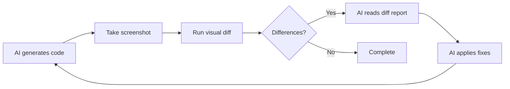

# Using auto-image-diff with AI Coding Agents

This guide explains how to effectively use auto-image-diff with AI coding agents like Claude Code, GitHub Copilot, and other AI-powered development tools.

## Table of Contents

- [Overview](#overview)
- [Benefits for AI-Assisted Development](#benefits-for-ai-assisted-development)
- [Setting Up for AI Workflows](#setting-up-for-ai-workflows)
- [Common AI Agent Use Cases](#common-ai-agent-use-cases)
- [Best Practices](#best-practices)
- [Claude Code Specific Tips](#claude-code-specific-tips)
- [Troubleshooting AI Workflows](#troubleshooting-ai-workflows)

## Overview

AI coding agents excel at generating code but often struggle with visual verification. auto-image-diff bridges this gap by providing automated visual regression testing that AI agents can use to verify their UI changes.

### Why AI Agents Need Visual Testing

1. **No Visual Perception**: AI agents can't "see" the rendered output
2. **Style Verification**: CSS and styling changes need visual confirmation
3. **Layout Issues**: Positioning problems are hard to detect from code alone
4. **Cross-Browser**: AI-generated code may render differently across browsers

## Benefits for AI-Assisted Development

### 1. Automated Verification

AI agents can run visual tests to verify their changes:

```bash
# AI agent can run this after making UI changes
aid compare baseline.png current.png output/ --threshold 0.1
```

### 2. Classification Feedback

The classification system helps AI understand what changed:

```bash
# AI gets detailed feedback about change types
aid compare before.png after.png output/ --classify

# Output helps AI understand:
# - Content changes (text modifications)
# - Style changes (CSS updates)
# - Layout changes (positioning)
```

### 3. CSS Fix Suggestions

AI agents can use CSS suggestions to fix styling issues:

```bash
# Generate CSS fixes for style differences
aid compare design.png implementation.png output/ --classify --css-fixes
```

### 4. Iterative Refinement

Progressive refinement helps AI agents improve accuracy:

```bash
# AI can iteratively refine exclusions
aid refine baseline.png current.png refinement/ --auto
```

## Setting Up for AI Workflows

### 1. Create Baseline Screenshots

Set up a baseline directory for AI agents to reference:

```bash
# Directory structure for AI workflows
project/
├── visual-tests/
│   ├── baseline/      # Reference screenshots
│   ├── current/       # AI-generated UI screenshots
│   ├── output/        # Diff results
│   └── exclusions.json # Dynamic content rules
```

### 2. Define Exclusions

Create exclusions for dynamic content that AI should ignore:

```json
{
  "regions": [
    {
      "x": 1200,
      "y": 10,
      "width": 200,
      "height": 30,
      "reason": "Timestamp - dynamic content"
    },
    {
      "x": 0,
      "y": 100,
      "width": 300,
      "height": 50,
      "reason": "User-specific data"
    }
  ],
  "patterns": [
    {
      "name": "loading-spinner",
      "bounds": { "x": 500, "y": 300, "width": 100, "height": 100 }
    }
  ]
}
```

### 3. Create AI-Friendly Scripts

Add package.json scripts for AI agents to use:

```json
{
  "scripts": {
    "visual:test": "aid compare ./visual-tests/baseline ./visual-tests/current ./visual-tests/output --classify",
    "visual:update": "cp ./visual-tests/current/* ./visual-tests/baseline/",
    "visual:report": "aid batch ./visual-tests/baseline ./visual-tests/current ./visual-tests/output --smart-pairing",
    "visual:fix-css": "aid compare ./visual-tests/baseline/page.png ./visual-tests/current/page.png ./output --css-fixes"
  }
}
```

## Common AI Agent Use Cases

### 1. UI Component Development

When AI creates a new component:

```bash
# 1. AI generates component code
# 2. AI takes screenshot of rendered component
# 3. Compare with design mockup
aid compare design-mockup.png ai-component.png output/ --classify --css-fixes

# 4. AI reads the CSS suggestions and applies fixes
# 5. Re-test until visual match is achieved
```

### 2. Style Refactoring

When AI refactors CSS:

```bash
# Before refactoring
aid capture current-ui.png

# After AI refactors CSS
aid compare current-ui.png refactored-ui.png output/ --threshold 0

# Should show zero differences if refactoring is correct
```

### 3. Responsive Design

Testing AI-generated responsive layouts:

```bash
# Test multiple viewport sizes
for size in "mobile" "tablet" "desktop"; do
  aid compare "baseline-${size}.png" "ai-generated-${size}.png" "output/${size}/"
done
```

### 4. Cross-Browser Testing

Verify AI code works across browsers:

```bash
# Compare Chrome vs Firefox rendering
aid compare chrome-screenshot.png firefox-screenshot.png output/ --threshold 0.5
```

## Best Practices

### 1. Structured Prompts for AI

When working with AI agents, provide structured prompts:

```markdown
Task: Update the login form styling
Requirements:

1. Match the design in baseline/login-form.png
2. Maintain responsiveness
3. Keep accessibility features

Verification:

- Run: npm run visual:test
- Diff should be < 0.1%
- No layout classification changes
```

### 2. Iterative Development Flow



### 3. Automated CI Integration

```yaml
# .github/workflows/ai-visual-tests.yml
name: AI Visual Regression Tests
on: [pull_request]

jobs:
  visual-test:
    runs-on: ubuntu-latest
    steps:
      - uses: actions/checkout@v3

      - name: Install dependencies
        run: |
          npm install -g auto-image-diff
          sudo apt-get install -y imagemagick

      - name: Run visual tests
        run: |
          # AI agents can trigger this workflow
          npm run visual:test

      - name: Upload diff artifacts
        if: failure()
        uses: actions/upload-artifact@v3
        with:
          name: visual-diffs
          path: visual-tests/output/
```

### 4. Feedback Loop

Create a feedback system for AI improvement:

```typescript
// visual-test-helper.ts
import { ImageProcessor } from "auto-image-diff";

export async function validateAIChanges(baseline: string, current: string): Promise<AIFeedback> {
  const processor = new ImageProcessor();
  const result = await processor.generateDiff(baseline, current, "diff.png", {
    runClassification: true,
    generateCssSuggestions: true,
  });

  return {
    isAcceptable: result.difference < 0.1,
    classification: result.classification,
    suggestions: result.cssSuggestions,
    feedback: generateAIFeedback(result),
  };
}

function generateAIFeedback(result: ComparisonResult): string {
  if (result.classification?.summary.layout > 0) {
    return "Layout changes detected. Check element positioning.";
  }
  if (result.classification?.summary.style > 0) {
    return "Style changes detected. Review CSS properties.";
  }
  return "Visual changes look good!";
}
```

## Claude Code Specific Tips

### 1. Workspace Setup

Create a `.claude/instructions.md` file:

```markdown
# Visual Testing Instructions

When making UI changes:

1. Always run `aid compare` before committing
2. Check classification results for unintended changes
3. Use `--css-fixes` flag for styling issues
4. Update baseline images when changes are intentional

Available commands:

- `npm run visual:test` - Run all visual tests
- `npm run visual:fix-css` - Get CSS fix suggestions
- `npm run visual:update` - Update baseline images
```

### 2. Claude Code Commands

Add to your Claude Code session:

```bash
# Check visual changes
/run aid compare baseline.png current.png output/ --classify

# Get CSS fixes
/run aid compare baseline.png current.png output/ --css-fixes --css-selector ".my-component"

# Batch process all screens
/run aid batch ./baseline ./current ./output --smart-pairing
```

### 3. Interactive Refinement

Use Claude Code's interactive capabilities:

```bash
# Start refinement session
/run aid refine baseline.png current.png refinement/

# Claude can help interpret the results and suggest exclusions
```

## Troubleshooting AI Workflows

### Issue: AI Makes Unnecessary Visual Changes

**Solution**: Provide stricter constraints

```bash
# Set very low threshold
aid compare baseline.png ai-output.png output/ --threshold 0.01

# Provide classification focus
aid compare baseline.png ai-output.png output/ --classify --focus style,layout
```

### Issue: AI Can't Match Exact Design

**Solution**: Use progressive refinement

```bash
# Let AI iteratively improve
aid refine design.png ai-output.png refinement/ --auto --target 0.1
```

### Issue: Dynamic Content Causes False Positives

**Solution**: Create comprehensive exclusions

```bash
# Generate exclusions from known dynamic areas
aid refine baseline.png current.png exclusions/ --exclude-types content
```

### Issue: AI Needs More Context

**Solution**: Embed metadata for AI reference

```bash
# Add context to images
aid compare baseline.png current.png output/ --embed-metadata

# AI can read metadata
aid read-metadata output/diff.png
```

## Advanced AI Integration

### 1. Custom AI Feedback Pipeline

```typescript
// ai-visual-pipeline.ts
class AIVisualPipeline {
  async validateUIChange(prDescription: string, screenshotPath: string): Promise<ValidationResult> {
    // 1. Extract intended changes from PR description
    const intendedChanges = this.parseIntendedChanges(prDescription);

    // 2. Run visual comparison
    const comparison = await this.runComparison(screenshotPath);

    // 3. Validate changes match intent
    const validation = this.validateAgainstIntent(comparison, intendedChanges);

    // 4. Generate AI-friendly report
    return {
      approved: validation.approved,
      feedback: this.generateAIFeedback(validation),
      cssFixSuggestions: comparison.cssSuggestions,
      nextSteps: this.suggestNextSteps(validation),
    };
  }
}
```

### 2. AI Learning from Visual Tests

```bash
# Create training data for AI
mkdir -p ai-training/visual-patterns

# Collect successful fixes
aid compare before.png after.png ai-training/case-001/ --classify --css-fixes

# AI can learn from patterns
find ai-training -name "*.json" -exec cat {} \; | \
  jq '.classification' > visual-patterns.jsonl
```

## Conclusion

auto-image-diff empowers AI coding agents to:

- Verify visual changes automatically
- Understand what type of changes occurred
- Get actionable CSS fix suggestions
- Iteratively improve UI accuracy

By integrating visual testing into AI workflows, you can achieve higher quality UI development with less manual intervention.
