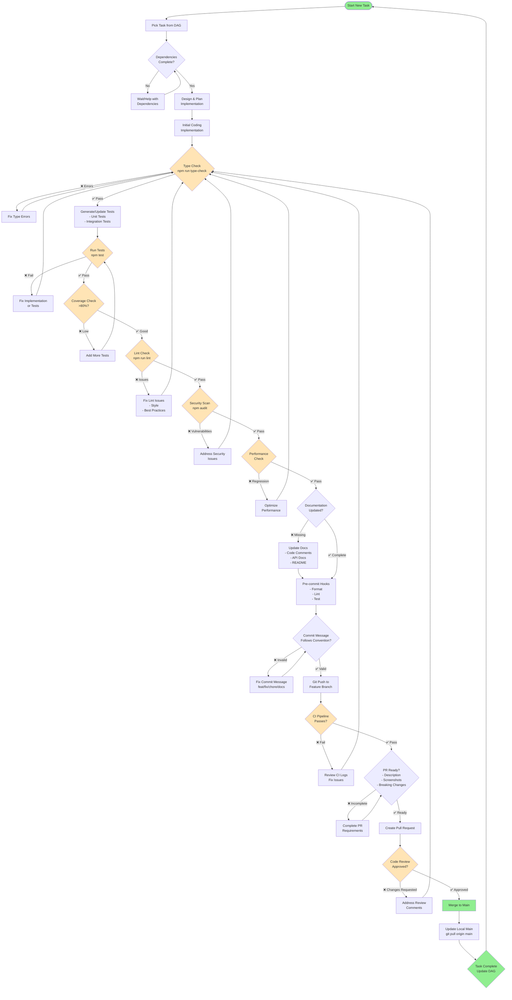

# How I vibe coded this, and why?

1. I used deep research/opus to help breakdown the tooling I wanted to build, and research the most effect options for what I need. 
2. I turned that into a basic PRD document (not present).
3. I turned that into the task-list.md
4. I turned that into the detailed-task-list.md, where dependencies for each task was taken into account
5. I turned that into the critical-success-tasks.md where I had claude focus on the tasks that are critical for the success of the project. Failure here could lead to downstream effects where the entire project fails. 
6. I used all of those to create a more accurate PRD imagediff-prd-detailed.md
7. I used all current notes to create the README.md
8. I then had claude create some documentation of the use-case this is being built for in figma-website-refinement-guide.md
9. I finally used opus to create a TODO.md that is used by my current vibe coding architecture to track the basic task management.

10. Use at work to create a recursive self-improvement system to increase throughput and quality of the code from vibe coding.

## Process

### This workflow ensures:

No broken code enters the main branch
Consistent code quality across the team
Early detection of issues
Automated checks reduce manual review burden
Documentation stays current with code changes
Performance regressions are caught early
Security vulnerabilities are identified
Test coverage remains high

> The cyclical nature ensures developers can't proceed until quality standards are met, dramatically reducing the need for large refactoring efforts later. RetryClaude can make mistakes. Please double-check responses.

